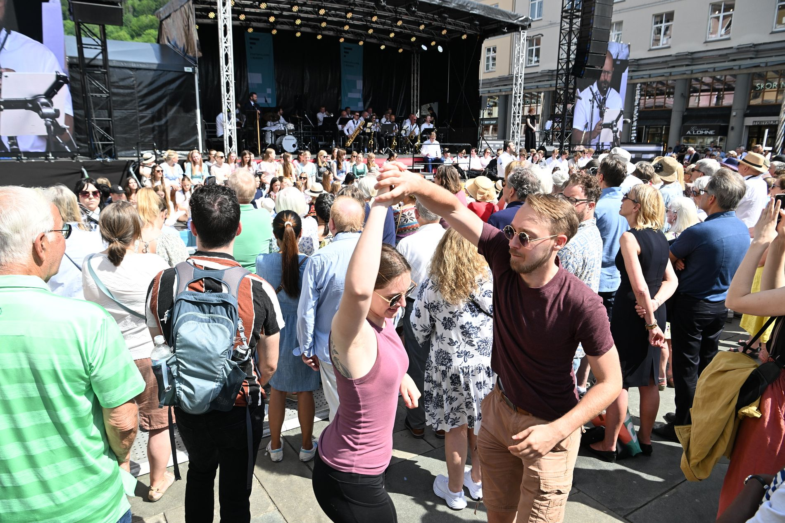

# Nå skal det koke i en måned. Slik kan du ta del i festen.

*Bergens Tidende (bt.no)*

---



Festspill, Nattjazz, Pride, Bergenfest og invasjon av både striler og buekorps. Bergen går inn i festivalsesongen med et brak.

17\. mai og pinsen er nettopp **unnagjort**`unnagjort` · *done and over with* · from **unna** "away" + **gjort** "done" (ON). Nå starter festivalsesongen i Bergen. De neste ukene skal det koke både i byens gater og kultursaler.

Som skuespiller Vidar Magnussen sa i 2024:

– Det skjer noe med bergensere når solen kommer. Vanlige nordmenn går i **dvale**`dvale` · *hibernation* · from ON **dvali** "sleep, trance", men bergensere, vi har ikke dvaleknapp!

```text {annotate}
Festspill, Nattjazz, Pride, Bergenfest og invasjon av både striler og buekorps. Bergen går inn i festivalsesongen med et brak.
---
striler | stril "coastal farmer near Bergen" (Bergen dialect) | people from the districts surrounding Bergen
buekorps | bue "bow" + korps "corps" (French/German) | children's marching brigades unique to Bergen
brak | brak "crash, bang" (ON brak "cracking noise") | a bang, with great force
```

Her er noe av det man kan se frem til, og tips til å oppleve **stemningen**`stemning` · *the atmosphere, mood* · from German **Stimmung** "mood, tuning" selv om man ikke er betalende **tilskuer**`tilskuer` · *spectator* · from **til** "to" + **skue** "to look" (ON **skuggja**).

---

## Festspillene i Bergen

**Hva:** Festspillene i Bergen · **Når:** 27. mai–10. juni · **Hvor:** Mange arenaer

Det er 74. gang Bergen inviterer til landets største festspill. Det betyr musikk, teater, dans og kunst i saler og **innendørsarenaer**`innendørsarena` · *indoor venues* · **innen** "inside" + **dør** "door" (ON **dyrr**) + **arena** (Latin) i 15 dager. Men Festspillene har også et stort utendørsprogram som mange vil oppsøke eller legge merke til, spesielt hvis de passerer Torgallmenningen.

```text {annotate}
Der kan man se åpningsseremonien onsdag. Deretter rigges den også i år om til en «Festallmenning», med scene, interaktive leker og et stort antall gratisarrangementer.
---
åpningsseremonien | åpning "opening" + seremoni "ceremony" (Latin ceremōnia) | the opening ceremony
rigges | rigge "to rig, set up" (MLG riggen "to equip") | is set up / converted
Festallmenning | fest "festival" + allmenning "public commons" (ON allmenningr "common land") | festival commons / public festival square
gratisarrangementer | gratis "free" (Latin grātīs) + arrangement "event" (French) | free events
```

Putekrig og dans, performance med Lars Vaular, pubkor, **vandreteater**`vandreteater` · *walking theatre, promenade theatre* · **vandre** "to walk" (MLG **wanderen**) + **teater** (Greek **theatron**) og mystiske «fløffer» er noe av det Festspillene lokker med.

I fjor hadde Festspillene 70.000 besøkende, rundt halvparten av dem på utendørsarrangementene.

---

## Nattjazz

**Hva:** Nattjazz · **Når:** 29. mai–6. juni · **Hvor:** USF Verftet

Festspillenes yngre **søsterarrangement**`søsterarrangement` · *sister event* · **søster** "sister" (ON **systir**) + **arrangement** (French) foregår som vanlig på USF Verftet. Her blir det åtte kvelder **tettpakket**`tettpakket` · *tightly packed* · **tett** "tight, dense" (ON **þéttr**) + **pakket** "packed" med konserter – og en med poesi.

```text {annotate}
Åpningskvelden arrangeres det gratiskonsert med Kjetil Møster og Bergen Big Band i Hallen på USF, men billettene må hentes ut på forhånd.
---
åpningskvelden | åpning "opening" + kveld "evening" (ON kveld) | on opening night
hentes ut | hente "to fetch" (MLG henten) + ut "out" | be picked up / collected
på forhånd | forhånd "beforehand" (for "before" + hånd "hand", ON hǫnd) | in advance
```

Kvelden etter er det allerede utsolgt, med Susanne Sundfør og Bugge Wesseltoft som hovedattraksjoner.

For mange er nok **uteserveringen**`uteservering` · *the outdoor seating/terrace* · **ute** "outside" + **servering** "serving" (Latin **servīre**) med utsikt mot Puddefjorden den aller største attraksjonen. I fjor registrerte Nattjazz rundt 22.000 besøk.

---

## Regnbuedagene / Bergen Pride

**Hva:** Regnbuedagene/Bergen Pride · **Når:** 29. mai–6. juni · **Hvor:** Flere arenaer, deriblant Kvarteret, Nygårdsparken og Marinehagen.

Regnbuedagene har blitt arrangert i mange år i Bergen. Arrangementet er mest kjent for den fargerike og populære **paraden**`parade` · *the parade* · from French **parade**, ultimately from Latin **parāre** "to prepare" gjennom sentrum på **avslutningsdagen**`avslutningsdag` · *the closing day* · **avslutning** "conclusion" (ON **slúta** "to end") + **dag** "day". I fjor deltok **titusenvis**`titusenvis` · *tens of thousands* · **ti** "ten" + **tusen** "thousand" (ON **þúsund**) + **-vis** "in groups of" i paraden i nydelig sommervær. I år går paraden 6. juni.

```text {annotate}
Men før det skal det være blant annet politiske debatter og kulturinnslag på «Pride House» på Kvarteret, og en tre dagers fest i Pride Park i Nygårdsparken. Det hele rundes av med festen Regnbuenatt på Marinehagen.
---
kulturinnslag | kultur "culture" (Latin cultūra) + innslag "feature, segment" (inn "in" + slag "strike") | cultural performances / features
rundes av | runde av "to round off, to wrap up" (ON rund via French rond) | is wrapped up / concluded
Regnbuenatt | regnbue "rainbow" (regn "rain" + bue "bow", ON bogi) + natt "night" | Rainbow Night
```

---

## Buekorpsenes Dag

**Hva:** Buekorpsenes Dag · **Når:** 30. mai · **Hvor:** Torgallmenningen og hele sentrum

Det skjer bare hvert fjerde år. Men da er det umulig å ikke legge merke til.

– Dette er større enn 17. mai, ble det **slått fast**`slå fast` · *stated firmly, established* · **slå** "to strike" (ON **slá**) + **fast** "firm" i 2022.

Buekorpsenes Dag er olympiske leker for alle som går i buekorps, og ikke minst alle som har gått i buekorps.

```text {annotate}
Det er dagen da gamlekarene og -damene finner frem finstasen, pusser medaljene og viser frem gamle kunster.
---
gamlekarene | gammel "old" + kar "man, fellow" (ON karl) | the old-timers (male)
finstasen | finstas "finery, best clothes" (fin "fine" + stas "finery", MLG state "splendor") | their Sunday best / finest attire
pusser | pusse "to polish, to clean" (MLG pussen "to adorn") | polish
kunster | kunst "art, skill, trick" (MLG kunst) | skills, feats
```

Tusenvis av marsjerende og trommende gjennom sentrum lager et **høytidelig**`høytidelig` · *solemn, ceremonial* · **høy** "high" + **tid** "time" (ON **hátíð** "festival") **spetakkel**`spetakkel` · *spectacle, commotion* · from Latin **spectāculum** "show" via MLG som man nok må være bergenser for å elske.

I år skjer det meste på Torgallmenningen. Innledende konkurranser fra klokken 10, deretter konsert klokken 15 og marsj fra Bergenhus. Utover kvelden fortsetter **festlighetene**`festlighet` · *festivities* · **fest** "party" (Latin **festum**) + **-lighet** (suffix forming abstract nouns) i mer **uhøytidelige**`uhøytidelig` · *informal, casual* · **u-** "un-" + **høytidelig** "solemn" former.

---

## Bergen Street Food Festival

**Hva:** Bergen Street Food Festival · **Når:** 28.–30. mai · **Hvor:** Bergenhus festning

En mer moderne tradisjon er **gatematfestivalen**`gatematfestival` · *street food festival* · **gate** "street" (ON **gata**) + **mat** "food" + **festival** på Bergenhus. I tre dager fylles området rundt Snekkerbrakken med **matvogner**`matvogn` · *food trucks* · **mat** "food" + **vogn** "wagon" (ON **vagn**) som tilbyr mat fra hele verden.

Tidligere har rundt 10.000 mennesker funnet veien til festivalen. I år har man konkurranse fra det **nyåpnede**`nyåpnet` · *newly opened* · **ny** "new" (ON **nýr**) + **åpnet** "opened", permanente gatematmarkedet, men utsikten er definitivt finere på Bergenhus. Og dersom du er mer interessert i drikke enn mat, er det ølfestival på Verftet 6. juni.

---

## Bergenfest

**Hva:** Bergenfest · **Når:** 10.–13. juni · **Hvor:** Bergenhus festning

66 konserter. Fire kvelder med plass til 9000 hver kveld. De kan fordele seg på fem scener og en rekke matboder og **pubområder**`pubområde` · *pub areas* · **pub** (English) + **område** "area" (ON **um** "around" + **ráð** "counsel, arrangement"). Det er Bergenfest i et **nøtteskall**`nøtteskall` · *nutshell* · **nøtt** "nut" (ON **hnot**) + **skall** "shell" (ON **skel**).

```text {annotate}
Festivalen har etablert seg som «starten på sommeren» i Bergen, selv om været har bydd på det meste i de årene den har blitt arrangert.
---
etablert | etablere "to establish" (French établir, from Latin stabilis "stable") | established
bydd på | by på "to offer, to present" (ON bjóða "to offer") | served up, offered
det meste | det meste "the most of it, everything" | all kinds of weather
```

På årets program står blant andre Tobias Sten, Lewis Capaldi, Veronica Maggio, The Hives, Kings of Convenience, Dagny, Natasha Bedingfield og Sigrid. Også i år blir det mye som skjer i BT-teltet nær inngangen.

9\. juni er det Bergenfest Ung, en gratis minifestival i **skoletiden**`skoletid` · *school hours* · **skole** "school" (Latin **schola**, Greek **scholē**) + **tid** "time" for 8.–10. trinn samt barnehager. Marstein er nok **høydepunktet**`høydepunkt` · *the highlight* · **høyde** "height" + **punkt** "point" (Latin **punctum**) for de eldste skoleungdommene.

---

## Fotball-VM på TV og pub

**Hva:** Fotball-VM på TV og pub · **Når:** 11. juni–19. juli · **Hvor:** På puber og i telt over hele Bergen

Ja, fotball-VM foregår i USA, Canada og Mexico. Men med utvidet **skjenking**`skjenking` · *serving of alcohol* · from ON **skenkja** "to pour, to serve drink" og plass til godt over 12.000 på de ulike **skjenkestedene**`skjenkested` · *licensed drinking establishments* · **skjenke** "to serve alcohol" + **sted** "place" under mesterskapet, vil VM merkes godt i Bergen også.

```text {annotate}
Ekstra telt settes opp både på Festplassen, Trekanttomten og i bakgårder. Konsertscener gjøres om til fotballarenaer og byens fotballpuber girer opp til en hektisk sommer.
---
Trekanttomten | trekant "triangle" + tomt "plot of land" (ON tómt "empty site") | the Triangle lot (a Bergen landmark)
bakgårder | bakgård "backyard, courtyard" (bak "behind" + gård "yard", ON garðr) | backyards / courtyards
girer opp | gire opp "to gear up" (English gear via ON gervi "equipment") | gear up, ramp up
hektisk | hektisk "hectic" (Greek hektikos "habitual", via Latin/French) | hectic, frantic
```

Så får vi se om Erling Haaland, David Møller Wolfe og co. **oppfyller**`oppfylle` · *fulfill, live up to* · **opp** "up" + **fylle** "to fill" (ON **fylla**) forventningene til både publikum og pubeiere.

---

## Torgdagen

**Hva:** Torgdagen · **Når:** 13. juni · **Hvor:** Fisketorget og Vågen

Siden 1977 har Torgdagen vært et av Bergens største kulturarrangement. Da kommer strilene til **byd'n**`byen` · *the city (dialectal spoken form)* · Bergen dialect contraction of **byen** "the city" (ON **býr**) på gamlemåten, med **fjordbåter**`fjordbåt` · *fjord boats* · **fjord** (ON **fjǫrðr** "inlet") + **båt** "boat" (ON **bátr**) eller egne **farkoster**`farkost` · *vessels, craft* · from MLG **varkost** "vessel", related to **fart** "travel" + **kost** "manner".

```text {annotate}
Gamle båter, gamle klær, salg av tradisjonsrik mat og ekte strilemusikk er blant de årvisse ingrediensene.
---
tradisjonsrik | tradisjon "tradition" (Latin trāditiō) + rik "rich" (ON ríkr) | rich in tradition
årvisse | årvis "annual, perennial" (år "year" + vis "certain, sure", ON víss) | perennial, dependably recurring each year
ingrediensene | ingrediens "ingredient" (Latin ingrediēns "entering into") | the ingredients
```

Her kåres best restaurerte båt og beste **antrekk**`antrekk` · *outfit, attire* · **an-** "on" + **trekk** "pull" (ON **draga**), i.e. "what one puts on". Og som **initiativtaker**`initiativtaker` · *initiator, founder* · **initiativ** "initiative" (Latin **initium** "beginning") + **taker** "taker" Johannes Kleppevik sang: «Kom lat oss dansa til trekkspelmusikken. Til sola går ned!»

*I papiravisen er datoen for Buekorpsenes Dag oppgitt til 28. mai. Det skulle vært 30. mai, som det står her i nettversjonen.*

<div style="height: 12rem"></div>