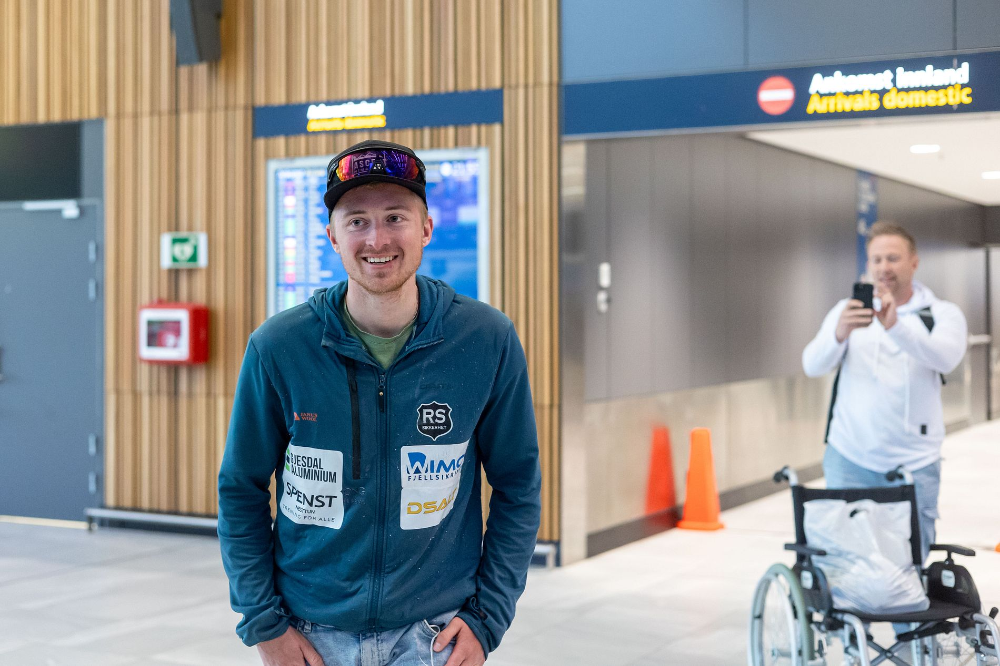

# Måtte behandles for frostskader etter Everest-bragd: – Mye følelser og glede

*BT.no (Bergens Tidende)*

---



Magnus Rørbakken ble tidenes yngste nordmann på toppen av Mount Everest. Tirsdag ankom han **Flesland**`Flesland` · *Bergen's airport* · named after the farm *Flesland*, from ON *fles* "flat rock" i rullestol.

– Litt kalde tær, men ellers går det bra, sier Magnus Rørbakken.

Han er akkurat blitt kjørt til **ankomsthallen**`ankomsthall` · *arrivals hall* · from *ankomst* (ON *ankoma* "to arrive") + *hall* (ON *hǫll* "hall") på Flesland i rullestol, men reiser seg når han ser velkomstkomiteen med norske flagg.

```text {annotate}
– Det er overveldende å se dette. Mye følelser og mye glede.
---
overveldende | over "over" + velde "to overpower" (MLG) | overwhelming
følelser | føle "to feel" (MLG völen) + -else (suffix) | emotions, feelings
glede | gleðja "to gladden" (ON) | joy, happiness
```

20. mai ble 23-åringen fra Tunes i Arna tidenes yngste nordmann på toppen av Mount Everest.

Tirsdag kveld landet han på Flesland etter den **historiske**`historisk` · *historic* · from Latin *historicus*, Greek *historikós* **bragden**`bragd` · *feat, exploit* · from ON *bragð* "trick, deed". Der ble han møtt av familie og kjente med norske flagg.

```text {annotate}
Men den historiske bragden kostet for 23-åringen. Etter Rørbakken kom ned til basecamp, måtte han behandles på frostskader på tærne. Først gikk turen til sykehus i Katmandu, før behandlingen fortsatte på Rikshospitalet i Oslo.
---
frostskader | frost "frost" (ON frostr) + skade "damage" (ON skaði) | frostbite injuries
behandles | behandle "to treat" (German behandeln) | to be treated
tærne | tå "toe" (ON tá) + -ene (def. pl.) | the toes
Rikshospitalet | rike "realm" (ON ríki) + hospital (Latin hospitāle) | the National Hospital (in Oslo)
```

– Den ene tåen har fått **tredjegrads**`tredjegrads` · *third-degree* · from *tredje* (ON *þriðji*) + *grad* (Latin *gradus* "step") frostskade. Jeg kan gå som normalt, men må ta det rolig. Jeg tror det kommer til å gå bra, sier han.

På Flesland tirsdag kveld sto mor Marit Rørbakken sammen med barna Lisa (15) og Elias (20).

– Det er **fantastisk**`fantastisk` · *fantastic* · from Greek *phantastikós* "making visible" å få ham hjem, helt **nydelig**`nydelig` · *wonderful, lovely* · from MLG *nüdelik* "pleasant". Det går ikke an å beskrive, sier Marit Rørbakken. Hun tok også imot ham da han kom til Oslo fra Katmandu.

```text {annotate}
Lillesøster Lisa ga sin bror en gråtkvalt klem da han kom ut i ankomsthallen.
---
lillesøster | lille "little" (ON lítill) + søster "sister" (ON systir) | little sister
gråtkvalt | gråt "crying" (ON grátr) + kvalt "choked" (ON kvelda) | choked with tears
klem | klemme "to squeeze, hug" (MLG klemmen) | hug, embrace
```

– Det er veldig fint å vite at nå er det helt over og at han er **trygg**`trygg` · *safe* · from ON *tryggr* "trusty, faithful" igjen. Nå gleder jeg meg bare til å ha ham her, sier hun.

Foreløpig kan ikke Magnus **belaste**`belaste` · *put strain on* · from German *belasten*, from *Last* "load, burden" foten så mye.

– Han er vant til å trene og være aktiv, nå blir det litt mer **passivt**`passiv` · *passive, inactive* · from Latin *passīvus* "capable of suffering". Lurer på hvordan det skal gå, sier moren og ler.

```text {annotate}
Hun forteller at sønnen først ble innlagt på sykehuset i Katmandu. Der skal de ha gått tom for medisin til frostskadebehandling, så han ble sendt videre til Rikshospitalet for å få behandling der.
---
innlagt | inn "in" + legge "to lay" (ON leggja) | admitted (to hospital)
gått tom for | gå tom "to run empty" (ON tómr "empty") | ran out of
frostskadebehandling | frost + skade + behandling (compound) | frostbite treatment
sendt videre | sende "to send" (ON senda) + videre "further" | sent onward
```

– Han kom bare smilende ut fra gaten på Gardermoen, og jeg bare **grein**`grine` · *cried* · from ON *grína* "to howl, cry". Så det var den **velkomsten**`velkomst` · *welcome* · from ON *velkominn* "well-come" han fikk, sier hun.

På Flesland sto **gratulasjonsklemmene**`gratulasjonsklem` · *congratulatory hugs* · from Latin *grātulātiō* "thanksgiving" + MLG *klemmen* "to squeeze" fra venner og familie i kø.

– Hva er det første du skal gjøre nå?

– Jeg hadde tenkt å kjøre til Søfteland og kjøpe **pannekaker**`pannekake` · *pancakes* · from *panne* (Latin *patina* "pan") + *kake* (ON *kaka*) på Jokeren der, men jeg tror de har **stengt**`stenge` · *closed* · from ON *stengja* "to bar, close", sier Magnus med et smil.

```text {annotate}
Norsk mat er nemlig noe av det han gleder seg mest til ved å komme hjem.
---
nemlig | nämligen "namely" (Swedish/MLG) | namely, you see
gleder seg til | gleðja "to gladden" (ON) + seg + til | looks forward to
```

Da passer det fint at lillebror Elias har sørget for at **favorittretten**`favorittrett` · *favourite dish* · from French *favori* + ON *réttr* "dish" taco står på **menyen**`meny` · *menu* · from French *menu* "detailed list".

– Jeg er veldig glad. Jeg gleder meg til å **tulle**`tulle` · *joke around, mess about* · from ON *þulla* "to mumble", later "to fool around" med ham igjen, sier lillebroren.

De neste dagene skal den nye **rekordholderen**`rekordholder` · *record holder* · from Latin *recordārī* "to remember" + ON *halda* "to hold" bruke på å slappe av.

```text {annotate}
– Så er det countryfestival i Arna i helgen. Jeg håper jeg kan gå der, sier Rørbakken.
---
helgen | heilagr dagr "holy day" (ON) | the weekend
håper | håpe "to hope" (MLG hopen) | hope
```

– Du har ikke planlagt noen nye **eventyr**`eventyr` · *adventures* · from MLG *eventure*, from French *aventure* da?

– Jeg har ingen planer akkurat nå, men du skal ikke se bort ifra at jeg kommer på noe når jeg får litt varme i disse tærne. Kanskje jeg skal skrive en bok, sier han **lattermildt**`lattermild` · *with a gentle laugh* · from ON *hlátr* "laughter" + *mildr* "mild, gentle".

<div style="height: 12rem"></div>