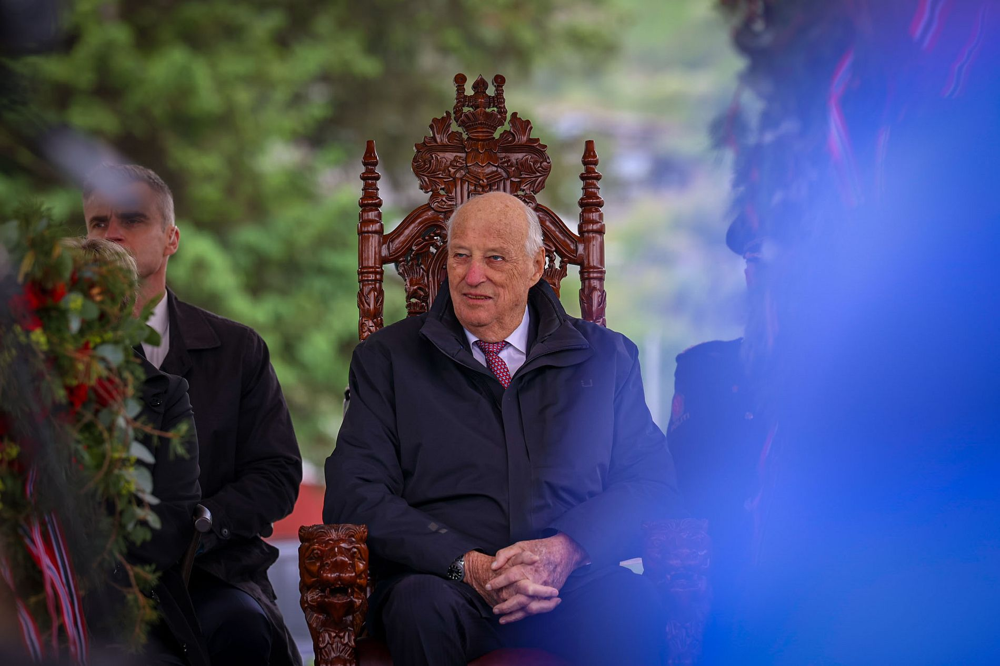

# For to år siden ba jeg kongen gå av. Det var like greit at han ikke hørte på meg.

*Marie Misund Bringslid, Bergens Tidende*

---



```text {annotate}
Flaggene vaiet, og tårene trillet da kongen besøkte Etne. Kanskje er det siste gang han besøker Vestland.
---
vaiet | veifa "to wave, swing" (Old Norse) | waved / fluttered
trillet | trilla "to roll" (Old Norse) | rolled (tears)
besøkte | be- "about" + søkja "to seek" (Old Norse) | visited
```

Etne har kanskje ventet i 900 år på **kongebesøk**`kongebesøk` · *royal visit* · ON *konungr* (king) + *be-* + *søkja* (to seek). Men det var ingen **sure miner**`sur mine` · *sour faces* · ON *súrr* (sour) + French *mine* (facial expression) på kaien da kongen endelig **steg i land**`stige i land` · *stepped ashore* · ON *stíga* (to step) + *land*. Bare litt sur vind.

Det var **bunad**`bunad` · *traditional folk costume* · ON *búnaðr* (equipment, attire), dress, **regnjakke**`regnjakke` · *rain jacket* · ON *regn* (rain) + French *jaque* (jacket) og **rullator**`rullator` · *walker/rollator* · Swedish coinage from *rulla* (to roll) + Latin *-ator*.

```text {annotate}
Barnehagebarn i kappe og krone, et nikk til barnekongen Magnus Erlingsson fra Etne, som bare var fem år da han ble kronet til konge i Bergen i 1163.
---
barnehagebarn | barn "child" + hage "garden" + barn "child" | kindergarten children
kronet | króna "to crown" (Old Norse) | crowned
```

For to år siden ba jeg kongen **gå av**`gå av` · *step down / resign* · ON *ganga* (to go) + *af* (off). Det var kanskje like **greit**`greit` · *fine / just as well* · ON *greiðr* (ready, clear) at han ikke hørte på meg.

Selv om **skandalene**`skandale` · *scandals* · Greek *skándalon* (stumbling block) har stått i kø for kongefamilien, har kongen sørget for **stabilitet**`stabilitet` · *stability* · Latin *stabilitas*.

```text {annotate}
Mens støtten til monarkiet og flere av medlemmene i kongefamilien har falt til et rekordlavt nivå, er kongen fortsatt superpopulær.
---
monarkiet | monos "alone" + arkhein "to rule" (Greek) | the monarchy
rekordlavt | rekord "record" + lavt "low" (ON lágr) | record-low
superpopulær | super "above" (Latin) + popularis "of the people" | super popular
```

Når han kommer på besøk til Vestland, kanskje for siste gang, er det ingen som snakker om skandale. Flaggene vaier og tårene triller. Det ropes tre ganger **hurra**`hurra` · *hooray* · possibly from ON *húrra* or German *hurra*, a battle cry.

Langs veien står folk i **finstasen**`finstas` · *Sunday best / finery* · *fin* (fine, ON *finnr*) + *stas* (finery, MLG *state*) og **vinker**`vinke` · *wave* · MLG *winken* (to signal) når han kjører forbi.

«**Kjempestort**`kjempestor` · *enormous* · ON *kempa* (warrior, giant) + *stórr* (big) og **kjempestas**`kjempestas` · *wonderful, grand* · ON *kempa* + *stas* (finery)», slår **ordføreren**`ordfører` · *mayor* · *ord* (word, ON *orð*) + *fører* (leader, ON *fǿra*) fast.

```text {annotate}
Etne ligger helt i ytterkanten av Vestland. Det er en av de siste kommunene kongen har på listen før han har besøkt alle kommunene i Norge.
---
ytterkanten | ytri "outer" (Old Norse) + kante "edge" (German) | the outer edge
kommunene | communis "common" (Latin) | the municipalities
```

De neste dagene står Samnanger, Vaksdal og Askvoll for tur før han har **rundet**`runde` · *rounded / completed* · ON *rund* from Latin *rotundus* (round) fylket.

Kongen går ikke lenger så mange skritt. Når han hører **Etnekoret**`Etnekoret` · *the Etne choir* · place name + *kór* from Latin *chorus* synge utenfor Stødle **kyrkje**`kyrkje` · *church (Nynorsk)* · ON *kirkja*, from Greek *kyriakón* (Lord's house), hviler han på sin **medbrakte**`medbrakt` · *brought-along* · *med* (with, ON *meðr*) + *brakt* (brought, ON *bragð*) **kongestol**`kongestol` · *king's chair* · ON *konungr* + *stóll*.

```text {annotate}
Kanskje er nettopp krykkestolen kongens moderne trone. I nyttårstalen beskrev kongen reisene rundt i landet som en «vitamininnsprøytning» og en «effektiv kur mot mismot».
---
krykkestolen | krykke "crutch" (MLG) + stol "chair" (ON stóll) | the crutch-chair
nyttårstalen | nýr "new" + ár "year" (ON) + tale "speech" | New Year's speech
vitamininnsprøytning | vitamin + inn "in" + sprøyte "inject" | vitamin injection
mismot | mis- "wrong" + mót "spirit, courage" (ON) | discouragement
```

Og det er virkelig **imponerende**`imponerende` · *impressive* · Latin *imponere* (to impose upon) at en konge som har begynt på sitt 90-ende år fortsatt har energi til å besøke hver **krik og krok**`krik og krok` · *nook and cranny* · ON *krikr* (bend) + *krókr* (hook, corner) i landet.

```text {annotate}
Jeg trodde 2023 var «annus horribilis» for det norske kongehuset, men det skulle bare bli verre. Etter det fortsatte kritikken mot Märtha Louise sin kommersialisering av prinsessetittelen.
---
annus horribilis | annus "year" + horribilis "horrible" (Latin) | horrible year
kongehuset | konungr "king" (ON) + hús "house" (ON) | the royal house
kommersialisering | commercium "trade" (Latin) + -isering | commercialization
prinsessetittelen | princeps "first" (Latin) + titulus "title" | the princess title
```

Det er fortsatt vanskelig å se for seg hvordan kongehuset skal legge bak seg alle de vanskelige sakene. 15. juni kommer **dommen**`dom` · *the verdict* · ON *dómr* (judgment) mot Marius Borg Høiby. Mest **sannsynlig**`sannsynlig` · *probably* · *sann* (true, ON *sannr*) + *syn* (sight, ON *sýn*) + *-lig* blir det også **ankesak**`ankesak` · *appeal case* · ON *anke* (complaint) + *sǫk* (case).

Dronning Sonja måtte stå over **fylkesturen**`fylkestur` · *county tour* · ON *fylki* (district) + *túr* (tour) til Vestland på grunn av **hjertesvik**`hjertesvik` · *heart failure* · ON *hjarta* (heart) + *svik* (failure, betrayal) og **hjerteflimmer**`hjerteflimmer` · *atrial fibrillation* · ON *hjarta* + German *Flimmern* (to flicker).

```text {annotate}
Likevel er det ikke til å komme unna at kronprins Haakon gjør stadig mer av jobben. Mens kongen reiser rundt og sjekker av de siste kommunene i Vestland, er det han som deler ut Abelprisen og åpner Festspillene i Bergen.
---
kronprins | króna "crown" (ON) + princeps "first" (Latin) | crown prince
Festspillene | festr "feast" (ON) + spil "play" (MLG) | the Festival (Bergen International Festival)
Abelprisen | Abel (mathematician) + prís "prize" (French) | the Abel Prize
```

– Vi må bare gjøre det beste ut av **situasjonen**`situasjon` · *the situation* · Latin *situatio* (position) som er, sa **kronprinsen**`kronprins` · *crown prince* · ON *króna* + Latin *princeps* til pressen tirsdag om helsen til Mette-Marit og dronning Sonja.

**Business as usual**`business as usual` · *business as usual* · English loanphrase, used unchanged in Norwegian har alltid vært kongehusets løsning, også i **krevende**`krevende` · *demanding* · ON *krefja* (to demand) + *-ende* tider.

<div style="height: 12rem"></div>
