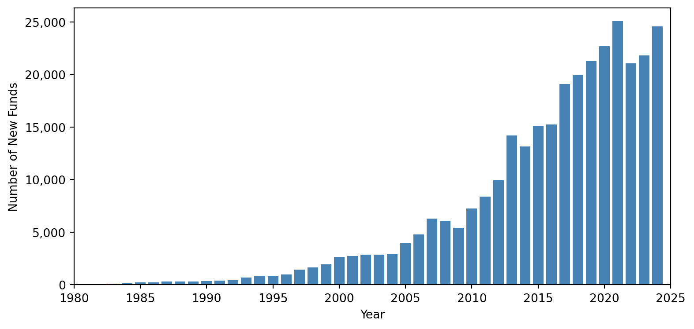

> [!note]
> In this post, I explore the distribution of mutual funds and their holdings based on Morningstar's datasets.

The analysis of mutual funds helps understand the behavior of active investors in capital markets, which is playing a key role in market efficiency and asset pricing. Before digging into model analysis, it is important to first have a big picture of their data distribution.

## I. MorningStar

Morningstar has comprehensive and granular mutual funds holding information, including stocks, bonds, loans, derivatives, cash and other funds. This database can be accessed via Morningstar Direct using [Excel](https://www.cbs.dk/files/cbs.dk/morningstar_direct_quick_start_guide.pdf) or [Python](https://pypi.org/project/morningstar-data/). However, it has daily download limits, which requires users to subscribe extra service. It is possible to download the whole databases within 20 years without extra subscription :)

Also, it is worth noticing that some open source tools, like [mstarpy](https://github.com/Mael-J/mstarpy), can help fetch data from Morningstar website for free, which includes stocks' price, funds' performance and so on.

## II. Preview

According to information provided by Morningstar Direct, there have been historically `331,112` mutual funds (after dropping observations with duplicated securityID) from global `78` areas so far, and they are managed by around `26,086` teams of managers.

The table below shows the distribution of funds by area. It can be observed that `(LUX)`(Luxembourg) is the area with the highest number of registered open-funds.

```python {hide}
import pandas as pd

data = [
    ["LUX", 82008, 9077, 2524, 352, 553, 28341, 19774, 471, 840, 276],
    ["KOR", 29764, 6782, 178, 121, 49, 12067, 3183, 6946, 410, 0],
    ["IRL", 27465, 1869, 1111, 64, 64, 9889, 6314, 145, 926, 9],
    ["USA", 23055, 4847, 370, 94, 74, 11253, 6183, 209, 1, 0],
    ["BRA", 21037, 2075, 4114, 0, 0, 3512, 4431, 5011, 406, 0],
    ["CHN", 20884, 9466, 23, 67, 90, 4366, 5908, 0, 944, 0],
    ["CAN", 18728, 5989, 691, 48, 0, 8793, 2714, 162, 303, 0],
    ["GBR", 13339, 4423, 123, 0, 8, 6136, 1846, 39, 101, 254],
    ["IND", 11986, 1627, 293, 143, 0, 4570, 4014, 0, 1336, 0],
    ["FRA", 10978, 3005, 195, 19, 159, 3989, 2452, 363, 429, 95],
    ["JPN", 5687, 1148, 86, 40, 38, 2826, 1411, 65, 38, 0],
    ["ZAF", 5361, 2555, 1, 1, 0, 1637, 894, 18, 235, 0],
    ["MEX", 4827, 873, 0, 0, 0, 1065, 2169, 468, 228, 0],
    ["CHE", 4453, 893, 61, 161, 21, 1916, 1001, 10, 139, 7],
    ["TWN", 4128, 1248, 0, 1, 0, 1045, 1421, 4, 49, 0],
    ["AUS", 4045, 635, 142, 5, 0, 2100, 746, 186, 73, 155],
    ["THA", 3850, 430, 0, 63, 0, 1997, 1047, 219, 89, 0],
    ["ESP", 3713, 1560, 90, 0, 2, 904, 914, 185, 46, 6],
    ["DEU", 3332, 1324, 166, 25, 29, 1134, 488, 65, 15, 65],
    ["CHL", 3129, 549, 21, 0, 0, 869, 948, 465, 277, 0],
]

columns = ["Area", "Total Funds", "Allocation", "Alternative", "Commodities", "Convertibles", "Equity", "Fixed Income", "Miscellaneous", "Money Market", "Property"]
df = pd.DataFrame(data, columns=columns)
print(df.to_html(index=False))
```

Also, I find that the number of new funds has been steadily increasing from 1980 to 2024, which means that investor interest and market participation have been expanding over this period.



Next, I am also interested in `CurrenyHolding` (fund currency holdings) and distribution of funds in different capital markets (e.g. `FundFromArea` and `FundNumber`). The `FundSize` field in the database is reported in its original currency and I have converted them to USD for comparison purpose.

```python {hide}
import pandas as pd

data = [
    ["US Dollar", 52, "65,941", "192,716,721,513,643"],
    ["Euro", 46, "74,081", "67,259,384,772,869"],
    ["British Pound", 24, "26,048", "31,801,104,595,294"],
    ["Canadian Dollar", 12, "18,149", "14,767,637,062,704"],
    ["Swiss Franc", 19, "10,751", "11,654,570,492,995"],
    ["Chinese Yuan Renminbi", 9, "20,807", "8,409,569,779,617"],
    ["Indian Rupee", 1, "11,924", "6,630,231,484,599"],
    ["Singapore Dollar", 16, "3,209", "5,873,308,297,368"],
    ["Australian Dollar", 16, "5,820", "4,699,116,009,029"],
    ["Japanese Yen", 20, "7,417", "4,355,501,278,286"],
    ["Swedish Krona", 12, "3,252", "3,634,777,043,566"],
    ["Mexican Peso", 3, "4,761", "3,002,022,920,598"],
    ["Hong Kong Dollar", 9, "1,957", "2,860,164,917,677"],
    ["Norwegian Krone", 11, "2,549", "2,747,351,479,069"],
    ["Brazilian Real", 3, "20,440", "2,076,605,805,563"],
    ["South Korean Won", 1, "29,007", "1,888,774,538,513"],
    ["South African Rand", 6, "5,774", "1,785,702,981,489"],
    ["Offshore Chinese Yuan", 11, "1,560", "1,502,943,656,961"],
    ["Danish Krone", 6, "1,285", "693,252,513,697"],
    ["Polish Zloty", 5, "443", "617,500,875,444"],
]

columns = ["CurrencyHolding", "FundFromArea", "FundNumber", "FundSize"]
df = pd.DataFrame(data, columns=columns)
print(df.to_html(index=False))
```

The `United States`, `European Union`, and `Britain` are the leading global capital markets, dominating in both mutual fund number and magnitude of assets under management due to their mature financial systems and investor bases. In contrast, `South Korea` attracts no foreign mutual funds, likely due to regulatory or market barriers, while `Japan` remains more open. Among developing markets, `China` draws the most foreign investment, whereas `India`, despite its market size, sees no foreign mutual fund participation.

> [!note]
> To clarify, Table I indicates that there are `29,764` funds registered in `South Korea`. Table II further reveals that `29,007` of these funds primarily hold assets in `Korean Won`, while the rest are denominated in other currencies.

## III. Analysis

Morningstar provides granular holdings data for `300,170` mutual funds, covering `164` asset types such as equities, bonds, loans, derivatives, property, and crypto. However, some funds lack holdings data, and the dataset suffers from missing values and inconsistent naming. Linking assets to issuers is challenging due to `limited mapping tables` and `unreliable name matching`. In other words, It is time-consuming to clean the data and match them with Crsp and Compustat. (I will elaborate process of cleaning data in the future.)
