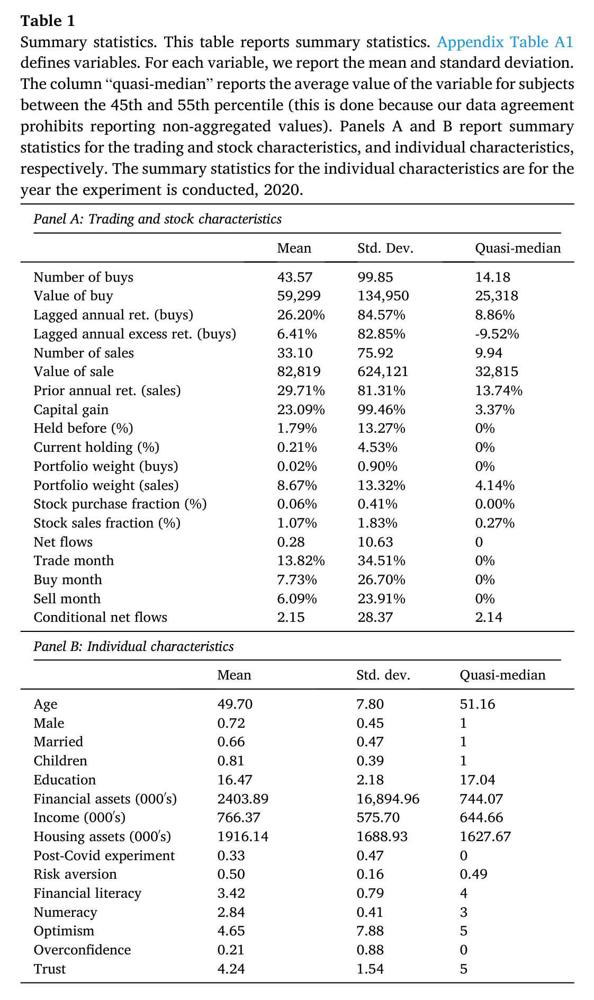
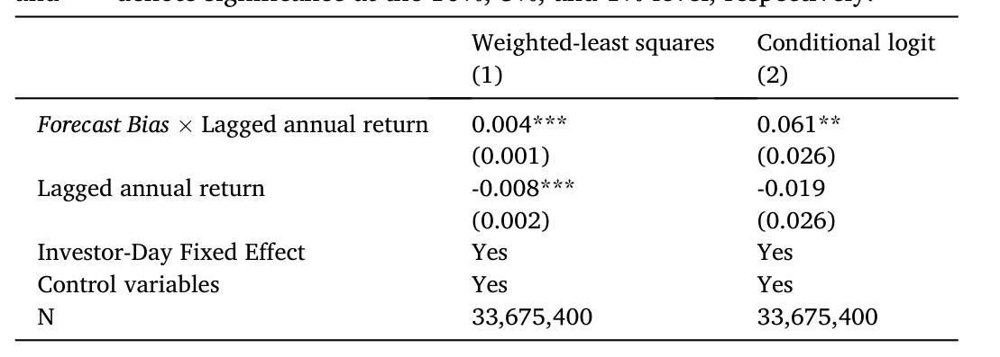
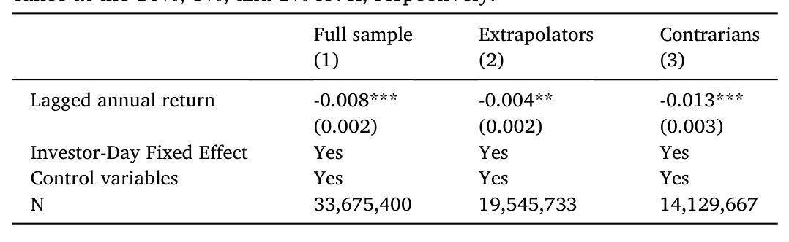

> [!note]
> 这篇文章我读的是 **Andersen, Dimmock, Nielsen, and Peijnenburg (2026, *Journal of Financial Economics*)**。它做了一件以往文献想做却很难做到的事：把同一批人在**实验室**里测出的「预测偏差」，和他们在**真实账户**里十一年的逐笔交易记录对接起来，从而第一次直接证明——一个人是「外推者 (extrapolator)」还是「逆势者 (contrarian)」，决定了他买什么股、卖什么股、以及在大盘涨跌时往股市里加仓还是减仓。更妙的是，作者论证：**预测偏差是一个统一的机制**，它让三种不同的「过去业绩」信号（个股过去收益、资本利得、过去大盘收益）分别去驱动三种不同的决策（买入、卖出、净流入）。

## 1 引言

对行为金融感兴趣的人大概都听过「外推」这个词。所谓外推 (extrapolation)，简单地说就是：看到一只股票最近涨得好，就觉得它以后还会接着涨，于是去追；而它的反面——逆势 (contrarian) 思维——则是看到最近涨得好，反而觉得「涨多了该回调了」，于是回避甚至卖出。这两类信念，在过去二十年里几乎撑起了行为资产定价的半壁江山：动量 (momentum)、长期反转 (long-term reversal)、价值溢价，乃至整个市场层面的泡沫与崩溃，文献里都习惯把它们归因于投资者的「预测偏差 (forecast bias)」。

然而，这里一直藏着一个让人不太舒服的缺口。绝大多数关于「预期」的实证研究，用的是**问卷**：问你觉得未来大盘会涨多少，然后看你这个回答和你往大类资产（比如股票 vs. 债券）上的配置是否吻合。这套做法很有价值，但它有两个先天的局限。其一，问卷测的是「信念」本身，研究者只能从你说出来的预期里**反推**你有没有偏差，而你说的预期里既混着「你掌握的信息」，又混着「你处理信息的方式」，两者纠缠不清。其二，问卷研究的落脚点几乎都停在**大类资产配置**上——它能告诉你「乐观的人股票仓位更高」，却几乎说不清：在同一个时点、面对一篮子可买的个股，偏差到底如何左右你**选了哪一只**。

> [!note]
> 这篇论文最核心的贡献，正是把上面这两个缺口一并补上。它不去问「你预期未来涨多少」，而是直接在实验室里测出每个人「**处理信息的方式**」有多偏；再用这个偏差参数，去解释这个人在真实世界里**对个股的取舍**。这是文献里第一份把「实验室测得的信念形成偏差」与「散户对个股的买卖决策」直接挂钩的直接证据。

我想先把这篇文章最关键的那一手——也就是它的识别思想（the key part）——讲透，再回头补齐实验设计、数据和结果。因为一旦你抓住了它的识别逻辑，剩下的一切都会变得顺理成章。

## 2 最关键的一手：实验室参数 × 个股过去业绩，加上「投资者—日」固定效应

先说实验那一半。作者邀请了一批**有代表性**的丹麦投资者进实验室，做一个完全照搬 Afrouzi et al. (2023) 的预测任务：屏幕上滚动播放一个随机过程的取值，受试者看完 40 个历史实现值后，预测下一期；看到新值，再预测下一期；如此重复 40 轮。这个过程其实是一个一阶自回归 (AR(1)) 过程，

$$x_{t+1} = 100 + 0.5\cdot(x_t - 100) + \varepsilon_t,$$

均值 100、自回归系数 0.5、误差服从标准差为 25.8 的正态分布。**注意：受试者并不被告知这是什么过程，更没有被告知它和股票有任何关系**——作者特意把它做成一个「通用」的、不带任何金融标签的任务。这一点很要紧，下文还会再提。

有了每个人 40 轮的预测，作者就用一条回归估出每个人的偏差参数 $b_i$：

$$F_{i,t}(x_{i,t+1}) - E_{i,t}(x_{i,t+1}) = a_i + b_i\cdot(x_{i,t} - \bar{x}) + \varepsilon_{i,t}.$$

等式左边是「你的预测」减去「在已知真实过程下的理性预测」，也就是**预测误差**。右边把这个误差对「当前实现值偏离均值的幅度」做回归，斜率 $b_i$ 就是这个人的 `Forecast Bias`。$b_i > 0$ 是外推者：高值之后预测得太高、低值之后预测得太低（追涨杀跌的信念）；$b_i < 0$ 是逆势者：高值之后反而压低预测（高了要跌的信念）。作者的样本里平均偏差为正（人们总体上是外推者），但**横截面上差异极大**：相当多的人是逆势者，也有不少人近乎理性。正是这个横截面差异，成了后面解释真实交易的「自变量」。

这里有一个我认为非常漂亮的概念取舍：作者刻意去测「信息处理方式」而不是「信息本身」。因为信息处理方式是一个**单一的、可迁移的参数**——它不依赖于具体是哪只股票、哪个时段、哪类决策。于是你只需要在实验室里测出一个 $b_i$，就能拿它去横跨千千万万只股票、十几年的交易去用。这正是为什么作者敢说「我们绕开了一个几乎无法完成的任务」：否则你得为每个投资者、每只股票、每个时点都构造一条预期的时间序列。

现在说真实交易那一半，也就是识别的核心。作者只看「**某个人当天确实交易了**」的那些日子，然后为每个「投资者—日」构造出他**当天本可以合理交易的那一篮子股票**。核心回归是：用「那天实际买的是哪只股」去对 `Forecast Bias × 该股过去业绩` 的**交互项**做回归，并放进**「投资者—日」固定效应 (investor-day fixed effects)**。

> [!tip]
> 「投资者—日」固定效应是这篇文章识别的命门，值得停下来想清楚它干掉了什么。它把**同一个人、同一天**的所有特征一次性吸收殆尽：你的财富、你的风险偏好、你过去的人生经历、你当天对大盘的择时判断、当天的市场行情……这些**直接**作用在交易上的东西，全被固定效应清零了。剩下能动的，只有「在当天这一篮子候选股之间，你为什么偏偏挑了这一只」。而交互项告诉我们：一只股票「过去涨得多」这件事，对你的吸引力是正是负、是大是小，取决于你的 `Forecast Bias` 有多高。

换句话说，作者不是在比较「外推者和逆势者谁交易更频繁、谁仓位更重」——那些都被固定效应吃掉了；他比较的是**同一个决策时点上、对过去业绩这一个信号的解读差异**。这就把「偏差」与一大堆纠缠的遗漏变量干净地剥离开了。理论（Barberis et al. 2015, 2018）预测：外推偏差越高，越会去买过去涨得多的股；逆势偏差越高，越会去买过去跌得多的股。识别策略要检验的，正是这条交互效应。

*Table 1: variables, and i,t is an investor-day fixed effect. The unit of observation*

## 3 数据

实验这一半，最终有 959 名受试者完成了预测任务（平均花 9 分 47 秒做完 40 轮，四个预测一分钟，只有极少数人用时异常）。真实交易这一半，来自丹麦统计局 (Statistics Denmark) 的行政登记数据，覆盖 **2011–2021 共十一年**，包含**每一位**丹麦投资者的逐笔股票交易，自然也包括这批受试者实验前后的全部交易、收入、财富与人口学信息。观测单位是「投资者—日—候选股」。

这套「实验室 + 行政数据」的组合拳，好处是双向的。实验室给了你对数据生成过程和信息环境的**完全控制**，让你能干净地测出偏差参数；行政数据则给了你一个**有代表性、记录完整且准确**的真实交易样本，没有问卷里常见的自我报告噪音。两边一对接，你就能在「信念如何形成」与「个股如何取舍」之间，看到一条以往看不到的直接链路。

## 4 他们发现了什么

**第一，买入。**结果非常清晰：一个人的偏差，确实和他买入股票的过去收益正相关——外推者倾向于买过去涨得多的股，逆势者倾向于买过去跌得多的股。量级上，`Forecast Bias` 每提高一个标准差，对应于买入股票的**过去一年收益高出 3.0 个百分点**。这正是理论预测的符号与方向。

*Table 2: between Forecast Bias and stock purchase decisions. We partition the*

**第二，卖出。**有意思的地方来了。对卖出决策，`Forecast Bias` 与所卖股票的**过去一年收益无关**，却与该股的**资本利得 (capital gains)** 显著负相关。这说明：在「卖」这件事上，最**凸显 (salient)** 的过去业绩信号不是「这股过去涨了多少」，而是「我在这股上赚了多少」。量级上，`Forecast Bias` 提高一个标准差，会使一个人卖出「资本利得高一个标准差」的股票的概率，相对基准概率**下降 6.1 个百分点**。直觉上，外推者赚了钱反而舍不得卖（还会接着涨嘛），这与处置效应 (disposition effect) 文献里的资本利得机制接上了头。

**第三，净流入。**作者还看了资金净流入：偏差更高的投资者，会在**过去一年大盘收益高**之后，相对偏差低的投资者更多地往股市加仓。这一条把个股层面的故事推到了市场层面——和问卷文献里「外推者追大盘」的发现遥相呼应。（散户在大类层面追逐过去业绩、用脚投票地追涨杀跌，这件事我此前在 [《Mutual Fund》](/posts/mutual-fund-morningstar/) 里也有所触及。）

把这三条放在一起，就是这篇文章最想讲的那句话：**同一个预测偏差参数，让三种不同的「凸显业绩信号」分别驱动三种不同的决策**——个股过去收益→买入，资本利得→卖出，过去大盘收益→净流入。一个机制，三处落地。这种「以一驭三」的统一性，正是它比以往「就事论事」的研究高出一截的地方。

**第四，全样本的一致性。**最后，作者用**全体丹麦投资者**这个超大样本，验证了个体内部 (within-investor) 的一致性：那些买入相对高过去业绩股票的人，往往也会卖出相对低过去业绩的股票，反之亦然。买与卖在同一个人身上方向自洽——这恰恰是「偏差是一个共同的底层机制」该有的样子，也为结果的外部有效性加了一道背书。

*Table 3: reports an alternative approach examining the relation*

## 5 文献脉络

按石川的习惯，我想把这条研究的来龙去脉理一理，你才能看清这篇文章站在什么位置上。

**起点是「预期与过去收益挂钩」。**早期一批工作（De Bondt, 1993；Fisher and Statman, 2000）就发现，投资者对未来大盘的主观预期，强烈地受最近过去收益的牵引；Greenwood and Shleifer (2014) 把这一点做得最为系统，论证投资者是以一种「有偏」的方式在更新信念。与此同时，文献也反复强调横截面上的巨大异质性——Dominitz and Manski (2011) 等指出，不同人把过去收益吸收进预期的方式天差地别。

**第二条线是「预期预测配置」。**Vissing-Jorgensen (2003)、Malmendier and Nagel (2011)、Giglio et al. (2021) 等证明，投资者对市场的主观预期，确实能预测他们往风险资产上的配置。这两条线合起来，构成了「问卷预期」研究的主干：测信念 → 信念关联配置。

**第三条线是理论。**Barberis, Shleifer, and Vishny (1998)、Hong and Stein (1999) 开了「用投资者偏差解释动量与反转」的先河；到 Barberis et al. (2015, 2018) 把外推预期写进了正式的资产定价模型，明确给出「偏差越大、对近期业绩越敏感」的可检验含义。诊断预期 (Bordalo et al. 2018, 2019) 则从另一条路给信念的过度反应建了模。

**这篇论文站在哪里？**它与三条线都有交集，但做了两处关键的不同。其一，它**不靠问卷反推偏差，而是在受控实验室里直接测**——实验本身照搬经过严格验证的 Afrouzi et al. (2023)。其二，它把落脚点从「大类资产配置」下沉到了「**个股选择**」。和它最近的两篇，一是 Laudenbach et al. (2024)，用关于历史自相关的信念去解释 COVID 暴跌期间的入市资金流；二是 Liu et al. (2022)，也看了外推信念与买入股票过去收益的关系——但作者特别指出，Liu et al. 把「市场择时」和「横截面选股」混在一起做了，而本文借助「投资者—日」固定效应，把这两者干净地分开了。这是它在脉络中独有的位置。

## 6 我的判断

先说我欣赏的地方。**最漂亮的是那个「投资者—日」固定效应 × 交互项的设计**。行为金融做实证最头疼的就是遗漏变量：你看到「乐观的人买涨得多的股」，永远有人能反驳说，那不过是因为他更有钱、更敢冒险、或者那天他对大盘更看好。这套固定效应把这些「直接效应」一网打尽，只留下「在同一篮子候选股里、对过去业绩这一个信号的解读」，识别上干净得让人服气。再加上「实验室测参数、行政数据看行为」这个组合，几乎把自我报告噪音、信息混淆这些老问题一并绕开了。作者自己也很坦诚地把遗漏变量这关又走了几遍：用 Oster (2019) 的系数稳定性检验评估遗漏因子的潜在影响，加入投资者特征与过去业绩的交互项，并强调任何替代解释都必须**同时**解释两件事——预测误差对偏差的 **U 型**关系、以及偏差与买卖过去业绩的**单调**关系。这一招很有杀伤力：它直接把「认知能力差异」这类常见的替代故事排除了，因为偏差的高、低两端都偏离理性，而认知能力是单调的。

再说我会担心的地方。**第一是外部有效性的那一跳。**实验里测的是一个**不带任何金融标签**的 AR(1) 过程，作者据此假设「人际间偏差排序」在不同设定、不同自相关系数下是稳定的，从而能搬到真实股票上去用。作者引了 Landier et al. (2019) 和 Frydman and Nave (2017) 来支撑这个跨情境的稳定性，也诚实地承认：若这个假设不成立，只会削弱检验的功效、令结果偏向不显著。这是一个我愿意接受、但仍想看到更多直接验证的假设——比如把同一批人放进一个带真实股票标签的任务里，看排序是否真的稳定。**第二是 0.5 的自回归系数。**Afrouzi et al. (2023) 自己就发现，过程持续性越低、过度反应越强；作者为了让所有人的回答可比，固定取了 0.5。这固然合理，但意味着测出的偏差水平是「在 0.5 这个特定持续性下」的，把它当成一个可跨资产迁移的通用参数时，我心里仍有一丝保留。**第三**，识别再干净，落脚点仍是**相关性**而非因果——作者对此非常克制，明确声明不对「最优交易策略」表态，只记录偏差与过去业绩之间的相关，这一点我很认同。

后续我最想看到的，是把这个实验室参数**用进价格**。现在的链路停在「偏差 → 个体交易」，下一步自然是问：当一个市场里外推者的比例更高时，是否真的能在**总量**上观察到更强的动量、更明显的反转、或更剧烈的资金潮汐？如果能把「实验室测出的偏差分布」直接接到「资产价格的可预测性」上，那才算真正给行为资产定价的那一大类模型，递上了一块来自微观个体的、扎扎实实的地基。

就这篇而言，它已经把那条最难搭的桥——从实验室的一个参数，到真实账户里十一年的选股——稳稳地搭了起来。这件事本身，就很了不起。

---

## 参考文献

Afrouzi, H., Kwon, S. Y., Landier, A., Ma, Y., Thesmar, D. (2023). Overreaction in expectations: Evidence and theory. *Quarterly Journal of Economics* 138(3), 1713–1764.

Andersen, S., Dimmock, S. G., Nielsen, K. M., Peijnenburg, K. (2026). Extrapolators and contrarians: Forecast bias and individual investor stock trading. *Journal of Financial Economics* 181, 104291.

Barber, B. M., Odean, T. (2008). All that glitters: The effect of attention and news on the buying behavior of individual and institutional investors. *Review of Financial Studies* 21(2), 785–818.

Barberis, N., Shleifer, A., Vishny, R. (1998). A model of investor sentiment. *Journal of Financial Economics* 49(3), 307–343.

Ben-David, I., Hirshleifer, D. (2012). Are investors really reluctant to realize their losses? Trading responses to past returns and the disposition effect. *Review of Financial Studies* 25(8), 2485–2532.

Bordalo, P., Gennaioli, N., La Porta, R., Shleifer, A. (2019). Diagnostic expectations and stock returns. *Journal of Finance* 74(6), 2839–2874.

Bordalo, P., Gennaioli, N., Shleifer, A. (2018). Diagnostic expectations and credit cycles. *Journal of Finance* 73(1), 199–227.

De Bondt, W. F. M. (1993). Betting on trends: Intuitive forecasts of financial risk and return. *International Journal of Forecasting* 9(3), 355–371.

De Bondt, W. F. M., Thaler, R. (1985). Does the stock market overreact? *Journal of Finance* 40(3), 793–805.

Dominitz, J., Manski, C. F. (2011). Measuring and interpreting expectations of equity returns. *Journal of Applied Econometrics* 26(3), 352–370.

Fisher, K. L., Statman, M. (2000). Investor sentiment and stock returns. *Financial Analysts Journal* 56(2), 16–23.

Frydman, C., Nave, G. (2017). Extrapolative beliefs in perceptual and economic decisions: Evidence of a common mechanism. *Management Science* 63(7), 2340–2352.

Giglio, S., Maggiori, M., Stroebel, J., Utkus, S. (2021). Five facts about beliefs and portfolios. *American Economic Review* 111(5), 1481–1522.

Greenwood, R., Shleifer, A. (2014). Expectations of returns and expected returns. *Review of Financial Studies* 27(3), 714–746.

Hong, H., Stein, J. C. (1999). A unified theory of underreaction, momentum trading, and overreaction in asset markets. *Journal of Finance* 54(6), 2143–2184.

Jegadeesh, N., Titman, S. (1993). Returns to buying winners and selling losers: Implications for stock market efficiency. *Journal of Finance* 48(1), 65–91.

Landier, A., Ma, Y., Thesmar, D. (2019). Biases in expectations: Experimental evidence. Working paper, HEC Paris.

Laudenbach, C., Weber, A., Weber, R., Wohlfart, J. (2024). Beliefs about the stock market and investment choices: Evidence from a field experiment. *Review of Financial Studies*, forthcoming.

Liu, H., Peng, C., Xiong, W. A., Xiong, W. (2022). Taming the bias zoo. *Journal of Financial Economics* 143(2), 716–741.

Malmendier, U., Nagel, S. (2011). Depression babies: Do macroeconomic experiences affect risk taking? *Quarterly Journal of Economics* 126(1), 373–416.

Odean, T. (1998). Are investors reluctant to realize their losses? *Journal of Finance* 53(5), 1775–1798.

Oster, E. (2019). Unobservable selection and coefficient stability: Theory and evidence. *Journal of Business & Economic Statistics* 37(2), 187–204.

Vissing-Jorgensen, A. (2003). Perspectives on behavioral finance: Does "irrationality" disappear with wealth? Evidence from expectations and actions. *NBER Macroeconomics Annual* 18, 139–194.
